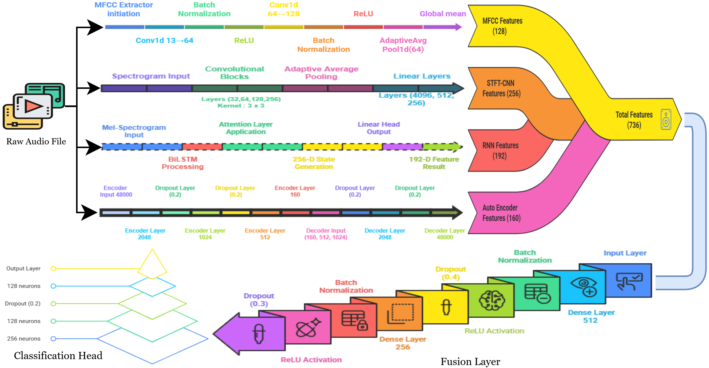

# AUDRON: Drone Type Recognition Using Acoustic Signals 🚁🔊

AUDRON (AUdio-based Drone Recognition Network) is a **deep learning framework for drone type recognition using acoustic signals**. The system leverages **fused audio feature representations** to robustly distinguish drone sounds from background noise and classify different drone types, even under challenging real-world conditions.

📄 **arXiv Paper**: https://arxiv.org/abs/2512.20407  

🎤 **Presented at the flagship conference**:  
**IEEE INDICON 2025 (22nd IEEE India Council International Conference)** —  
*Regenerative Artificial Intelligence: Advancing AI for Industrial, Societal, and Environmental Impact*

---

## 🧠 Model Architecture

The overall architecture of the proposed AUDRON framework is shown below:

AUDRON employs a **multi-branch hybrid architecture** with feature-level fusion for reliable acoustic drone detection.

---

## 📌 Project Overview

- 🎧 Drone detection and classification using **audio-only sensing**
- 🧠 Hybrid deep learning framework with **multiple acoustic representations**
- 🔀 Feature-level fusion for improved robustness
- 🧪 Evaluated on **binary and multiclass** classification tasks
- 📊 Achieves high accuracy under real-world noise conditions

---

## 📂 Repository Contents

- `AUDRON_Drone_Type_Classification(Binary_with_No_Augmentation).ipynb`  
  Binary classification experiment without data augmentation

- `drone-type-classification-using-drone-audio-sound.ipynb`  
  Complete pipeline for feature extraction, training, and evaluation

- `INDICON PRESENTATION 2025.pptx`  
  Conference presentation slides (IEEE INDICON 2025)

- `architecture.png`  
  Architecture diagram of the AUDRON framework

---

